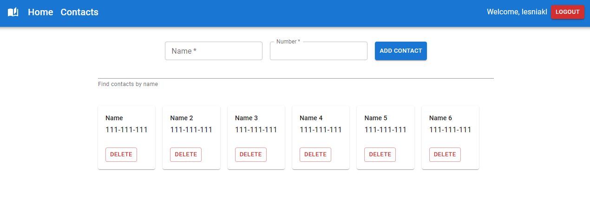
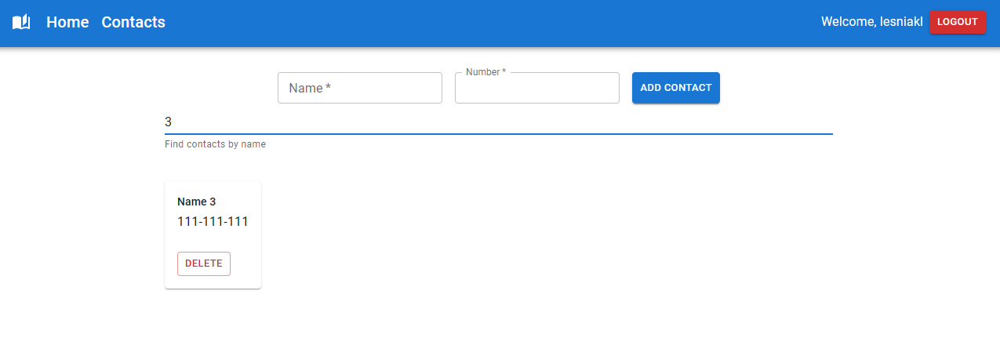

# SimplePhonebook app 3

This is a React app built using
[Create React App](https://github.com/facebook/create-react-app) as a part of
GoIT course. It allows you to save phone numbers together with names and store
them on your account.

## Features

New feature to this version is user's account handling. Entering the site you
will now have to register:


Or if you already made an account, head to the login page:


Using this app you store the following contact information:

- Name
- Phone number

Each entry can be deleted manually.



You can also filter your phonebook by name (this feature is case insensitive):



New entries cannot share the same names with exisiting ones (this feature also
is not case sensitive).

## Setup

1. Clone this repository.
2. Install the project's base dependencies using command

```shell
npm install
```

3. Start development mode by running command

```shell
npm start
```

4. You will now be able to access the app by going to
   [http://localhost:3000](http://localhost:3000) in your browser.
